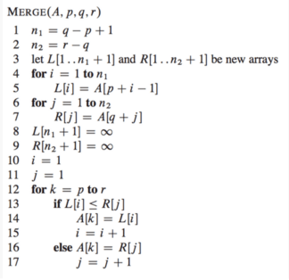
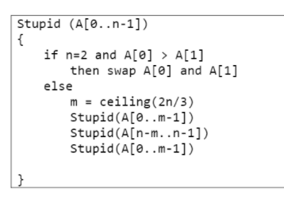
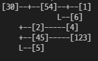

# 재귀

> 함께 학습하고 고민하고 설명하며 작은 부분 하나라도 '내 것'으로 만들어보세요. 😁


## 2번 - Merge Sort Time Complexity Proof

- Merge Sort가 진행되는 과정을 직접 그려보고 각 단계에서 어떤 일이 일어나는지 생각해보세요.
- 기초 수식에서 학습한 재귀식으로 표현하면 어떻게 되는지 같이 생각해보세요.


```python
Merge Sort(A,p,r)
If p < r then
    q = b(p + r)/2c
    MergeSort(A,p,q)
    MergeSort(A,q+1,r)
    Merge(A,p,q,r)
//else return

시간 복잡도
T(n)
= 2T(n/2) + n
= 2T((n-1)/4) + 2n
= ...
= 2k*T(n/2*k)+ kn
n/(2*k)을 1이라고 보았을때, k = logn이 된다.
따라서 위 식에 대입을 하면 n*T(1) + nlogn 이 된다.
결과적으로 O(nlogn)이 된다. 
```




## 4번 




```
swap의 횟수는 최대 무한대까지 가능하다.
```


## 6번


```python
from collections import defaultdict
input = [(30, 54), (30, 2), (30, 45), (54, 1), (45, 123), (30, 5),(2, 4), (54, 6)]
tree = defaultdict(list)
for item in input:
    tree[item[0]].append(item[1])
    
def print_tree(v, n):
    print('[',v,']',end='',sep='')
    cnt = len(tree[v])
    if cnt == 0:
        print()
    elif cnt == 1:
        print('-----',end='')
        print(tree[v])
        return
    else:
        for i, v in enumerate(tree[v]):
            if i == 0:
                print('--+--', end='')
                print_tree(v, n+1)
            elif i == cnt-1:
                print('    '*n,'     '*(n-1), 'L--', end='',sep='')
                print_tree(v, n+1)
            else:
                print('    '*n,'     '*(n-1), '+--', end='',sep='')
                print_tree(v, n+1)

print_tree(30, 1)
```

결과값:



​											


## 참고자료

http://www.bowdoin.edu/~ltoma/teaching/cs231/fall16/Lectures/02-recurrences/recurrences.pdf

https://www.cs.princeton.edu/courses/archive/spr07/cos226/lectures/04MergeQuick.pdf